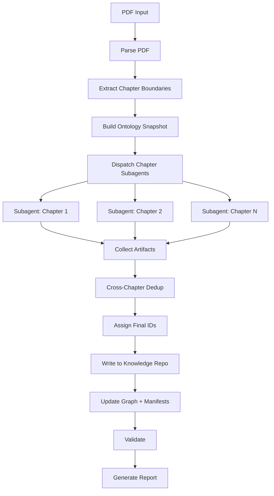

# PDF Ingestion Playbook

> **Playbook ID:** PB-002  
> **Version:** 2.0.0  
> **Owner:** AI Systems Engineer  
> **Updated:** 2026-07-24

---

## Purpose

Step-by-step guide for ingesting a large PDF document (e.g., 33MB accounting
textbook) into the knowledge repository using parallel chapter subagents.

---

## Prerequisites

- PDF file available and accessible
- Domain Agent configured
- Knowledge repository initialized
- Sufficient context window budget (3–5 concurrent subagents)
- Temp directory available at `/tmp/lumora-ingest/`

## Pipeline



## Steps

### Step 1: Parse PDF

**Actor:** Orchestrator

1. Load the PDF file using a PDF parsing library
2. Extract the table of contents (if available)
3. Identify chapter boundaries (page numbers, headings)
4. For each chapter:
   a. Extract text content
   b. Write to `/tmp/lumora-ingest/chapter-{N}.txt`
   c. Record metadata: title, page range, word count
5. Output: `/tmp/lumora-ingest/chapter-manifest.json`

```json
{
  "source": "./references/textbook.pdf",
  "total_chapters": 24,
  "chapters": [
    {
      "number": 1,
      "title": "Introduction to Accounting",
      "start_page": 1,
      "end_page": 45,
      "word_count": 12500,
      "file": "/tmp/lumora-ingest/chapter-1.txt"
    }
  ]
}
```

**Checkpoint:** Verify all chapter files are created and non-empty.

---

### Step 2: Build Ontology Snapshot

**Actor:** Orchestrator

1. Scan `knowledge/ontology/` for existing concept files
2. Scan `knowledge/rules/active/` for existing rule files
3. Scan `knowledge/glossary/` for existing glossary files
4. Build compact lookup files:

```json
// existing-concepts.json
[
  {"id": "CON-FIN-001", "name": "Assets", "context": "FIN"},
  {"id": "CON-FIN-002", "name": "Liabilities", "context": "FIN"}
]

// existing-rules.json
[
  {"id": "BR-001", "name": "Debit-Credit Balance", "type": "invariant"}
]

// existing-glossary.json
[
  {"term": "GAAP", "aliases": ["Generally Accepted Accounting Principles"]}
]
```

5. Write snapshot to `/tmp/lumora-ingest/ontology-snapshot.json`

**Checkpoint:** Snapshot reflects current state of knowledge repo.

---

### Step 3: Dispatch Chapter Subagents

**Actor:** Orchestrator

1. Load the chapter extractor prompt from `PR-002b`
2. For each chapter in the manifest:
   a. Prepare subagent input:
   - Chapter text path
   - Ontology snapshot path
   - Template paths
   - ID conventions
     b. Spawn subagent with `spawn_agent` (or equivalent)
     c. Set label: `"Extracting Chapter {N}: {title}"`
3. Dispatch in batches of 3–5 concurrent subagents
4. Wait for all subagents to complete

**Subagent input template:**

```
Extract knowledge from chapter {N} of the accounting textbook.

Chapter text: /tmp/lumora-ingest/chapter-{N}.txt
Existing concepts: /tmp/lumora-ingest/ontology-snapshot.json

Follow the chapter extractor prompt (PR-002b).
Output your artifact to: /tmp/lumora-ingest/artifact-chapter-{N}.json
```

**Checkpoint:** All chapter artifact files exist and are valid JSON.

---

### Step 4: Collect and Validate Artifacts

**Actor:** Orchestrator

1. Load all chapter artifacts from `/tmp/lumora-ingest/artifact-chapter-*.json`
2. Validate each artifact:
   a. Required fields present (concepts, rules, glossary, relationships)
   b. No final IDs assigned (subagents should not assign IDs)
   c. All potential duplicates have confidence scores
3. Aggregate totals:

```
Chapter 1: 12 concepts, 8 rules, 15 glossary terms
Chapter 2: 9 concepts, 6 rules, 11 glossary terms
...
Total: 180 concepts, 120 rules, 250 glossary terms
```

**Checkpoint:** All artifacts valid, no subagent errors.

---

### Step 5: Cross-Chapter Deduplication

**Actor:** Orchestrator

1. Load all chapter artifacts
2. Run deduplication:

   a. **Concept dedup:**
   - Group by normalized name (lowercase, strip whitespace)
   - Fuzzy match remaining (Levenshtein distance < 3)
   - For duplicates: keep the most complete definition
   - Record merge decision

   b. **Rule dedup:**
   - Group by normalized statement
   - Fuzzy match remaining
   - For duplicates: merge conditions and rationale
   - Record merge decision

   c. **Glossary dedup:**
   - Exact match on term (case-insensitive)
   - Exact match on aliases
   - For duplicates: merge definitions

3. Output dedup report: `/tmp/lumora-ingest/dedup-report.json`

```json
{
  "concept_merges": [
    {
      "kept": "Double-Entry Bookkeeping (Ch 1)",
      "merged": "Double-Entry System (Ch 5)",
      "confidence": 0.92,
      "action": "merged"
    }
  ],
  "rule_merges": [...],
  "glossary_merges": [...],
  "stats": {
    "total_concepts_before": 180,
    "total_concepts_after": 165,
    "duplicates_merged": 15
  }
}
```

**Checkpoint:** Dedup report generated, no unresolved conflicts.

---

### Step 6: Assign Final IDs

**Actor:** Orchestrator

1. Assign sequential concept IDs:
   - Group concepts by bounded context
   - Within each context, assign: CON-{CTX}-{001, 002, ...}
   - Maintain a global counter across all contexts

2. Assign sequential rule IDs:
   - BR-{001, 002, ...} globally

3. Assign relationship IDs:
   - REL-{001, 002, ...} globally

4. Remap all cross-references:
   - Update concept-to-concept relationships
   - Update rule-to-concept links
   - Update glossary-to-concept links

5. Output: `/tmp/lumora-ingest/id-mapping.json`

```json
{
  "concepts": {
    "Double-Entry Bookkeeping (Ch 1)": "CON-FIN-001",
    "Accounting Equation (Ch 1)": "CON-FIN-002"
  },
  "rules": {
    "Debit-Credit Balance (Ch 1)": "BR-001"
  }
}
```

**Checkpoint:** All IDs assigned, no gaps, no collisions.

---

### Step 7: Write to Knowledge Repository

**Actor:** Orchestrator

1. For each concept:
   a. Render content using `knowledge/templates/concept-template.md`
   b. Write to `knowledge/ontology/{CONTEXT}/{concept-slug}.md`
   c. Verify YAML front matter is valid

2. For each rule:
   a. Render using `knowledge/templates/rule-template.md`
   b. Write to `knowledge/rules/active/{rule-slug}.md`
   c. Verify YAML front matter is valid

3. For each glossary term:
   a. Render using `knowledge/templates/glossary-template.md`
   b. Write to `knowledge/glossary/{term-slug}.md`
   c. Verify YAML front matter is valid

4. For each relationship:
   a. Write to `knowledge/ontology/relationships/`

**Checkpoint:** All files created, YAML valid, no orphan writes.

---

### Step 8: Update Graph and Manifests

**Actor:** Orchestrator

1. Rebuild `knowledge/graph/graph.yaml`:
   - Scan all ontology files
   - Add new nodes (concepts)
   - Add new edges (relationships)
2. Regenerate `knowledge/graph/graph.json` from YAML
3. Update Mermaid diagrams in `knowledge/graph/`
4. Regenerate all manifests:
   - `knowledge/manifests/concepts.yml`
   - `knowledge/manifests/rules.yml`
   - `knowledge/manifests/glossary.yml`
5. Update all INDEX.md files:
   - `knowledge/ontology/INDEX.md`
   - `knowledge/rules/INDEX.md`
   - `knowledge/glossary/INDEX.md`
   - `knowledge/graph/INDEX.md`

**Checkpoint:** Graph and manifests are consistent with source files.

---

### Step 9: Validate

**Actor:** Orchestrator

1. **Orphan detection:**
   - Concepts with no relationships
   - Rules with no linked concepts
   - Glossary terms with no linked concepts

2. **Link validation:**
   - All cross-references resolve to existing files
   - No broken concept/rule ID references

3. **Duplicate detection:**
   - Final pass across all new + existing files
   - Flag any remaining potential duplicates

4. **YAML validation:**
   - All new files have valid YAML front matter
   - All required fields present

5. **Naming convention check:**
   - Files follow `{kebab-name}.md` pattern
   - IDs follow CON/BR/REL conventions

**Checkpoint:** All validation passes, no errors.

---

### Step 10: Generate Report

**Actor:** Orchestrator

Generate `knowledge/reports/INGESTION-{DATE}.md` containing:

```markdown
# PDF Ingestion Report

## Source

- File: textbook.pdf
- Size: 33MB
- Pages: ~800

## Extraction Summary

| Metric             | Count |
| ------------------ | ----- |
| Chapters processed | 24    |
| Concepts extracted | 165   |
| Rules extracted    | 120   |
| Glossary terms     | 250   |
| Relationships      | 95    |

## Deduplication

| Metric                     | Count |
| -------------------------- | ----- |
| Concept duplicates merged  | 15    |
| Rule duplicates merged     | 8     |
| Glossary duplicates merged | 12    |

## Per-Chapter Breakdown

| Chapter                 | Concepts | Rules | Glossary | Notes |
| ----------------------- | -------- | ----- | -------- | ----- |
| 1 - Introduction        | 12       | 8     | 15       |       |
| 2 - Accounting Equation | 9        | 6     | 11       |       |
| ...                     |          |       |          |       |

## Warnings

- Chapter 15: Low confidence extractions (possible OCR issues)
- 3 concepts flagged for human review

## Validation

- [x] No orphans
- [x] All links valid
- [x] No duplicates
- [x] YAML valid
- [x] Naming conventions followed
```

---

## Cleanup

After successful ingestion:

```bash
rm -rf /tmp/lumora-ingest/
```

## Rollback

If ingestion fails partway:

1. Identify which phases completed
2. Delete files created in Phase 5 (write phase)
3. Preserve artifacts in `/tmp/lumora-ingest/` for debugging
4. Re-run from failed phase

---

## Output

Updated knowledge repository with:

- New concepts in `knowledge/ontology/`
- New business rules in `knowledge/rules/active/`
- New glossary entries in `knowledge/glossary/`
- Updated graph in `knowledge/graph/`
- Updated manifests in `knowledge/manifests/`
- Ingestion report in `knowledge/reports/`
