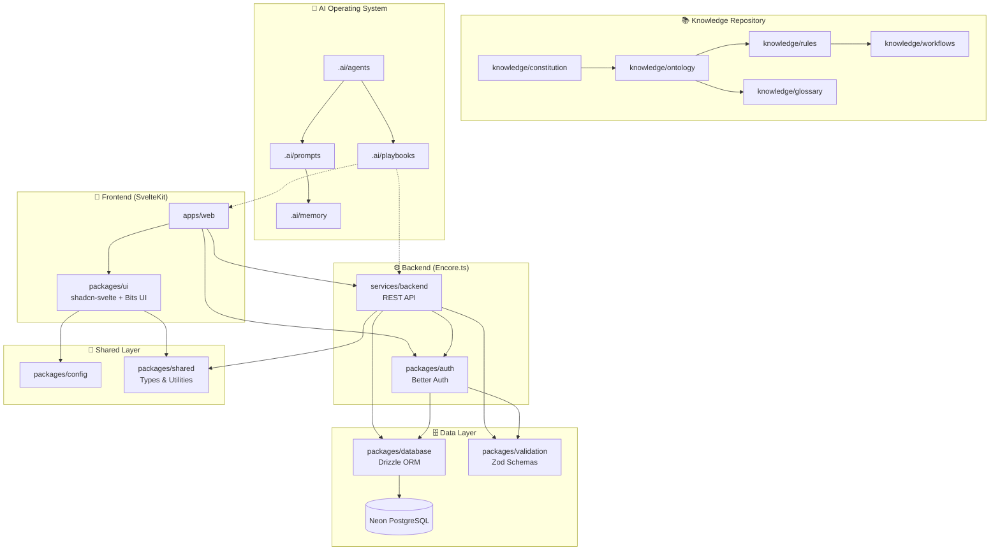
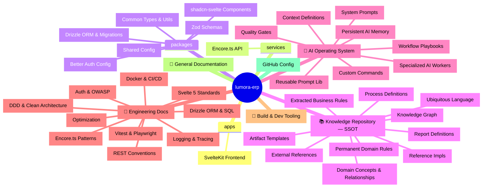
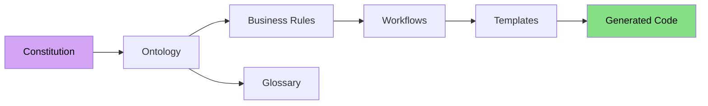
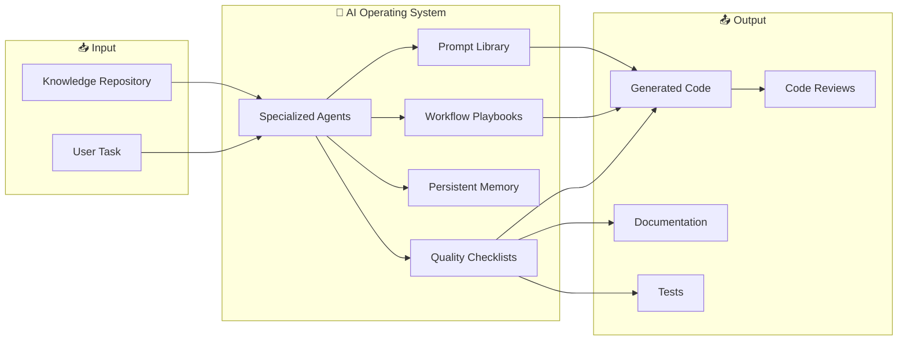
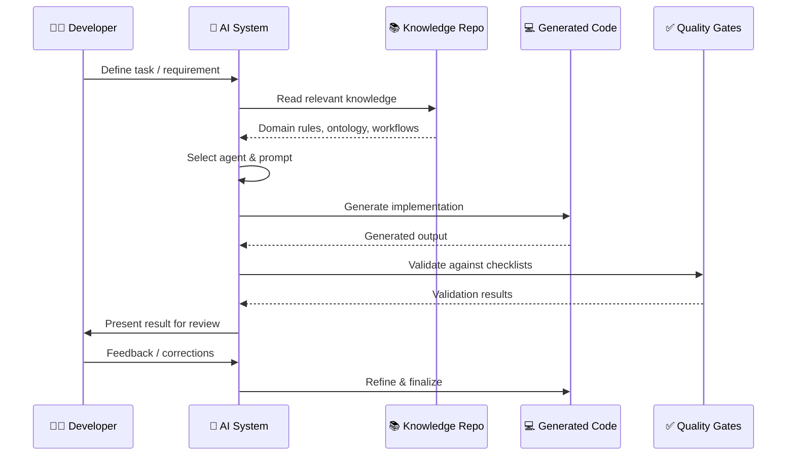
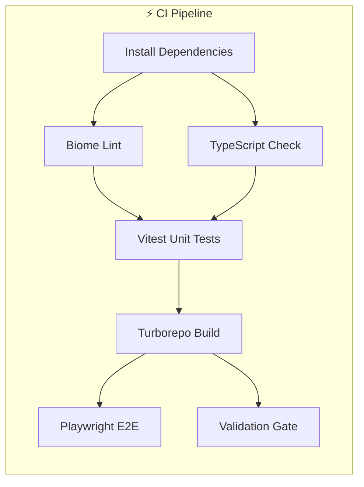
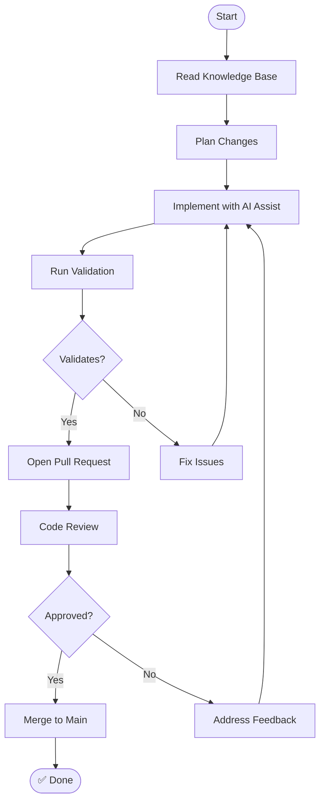

<div align="center">

# 🌟 Lumora ERP

### AI-First Enterprise Resource Planning System

> **Build the system. Let the AI build with you.**


---

**Lumora** is an AI-first ERP system for small-to-medium enterprises, built with a **Development Operating System** approach. The repository is the **Single Source of Truth (SSOT)** — every business rule, architectural decision, and line of generated code originates here.

> ⚡ **This repository builds the ERP. The ERP does not exist yet.**

---

</div>

## 📋 Table of Contents

- [Architecture Overview](#architecture-overview)
- [Repository Structure](#repository-structure)
- [Technology Stack](#technology-stack)
- [The Knowledge Repository](#the-knowledge-repository)
- [AI Operating System](#ai-operating-system)
- [Development Phases](#development-phases)
- [Getting Started](#getting-started)
- [Development Workflow](#development-workflow)
- [Testing & Quality](#testing--quality)
- [Contributing](#contributing)
- [License](#license)

---

## 🏗️ Architecture Overview

The system follows a **Clean Architecture / Domain-Driven Design** approach, organized as a Turborepo monorepo with strict dependency boundaries.



---

## 📁 Repository Structure



### Directory Legend

| Path | Purpose |
|------|---------|
| `apps/web/` | SvelteKit frontend application |
| `services/backend/` | Encore.ts API service |
| `packages/*/` | Shared libraries (UI, database, auth, types, config, validation) |
| `knowledge/` | **Single Source of Truth** — all business knowledge lives here |
| `.ai/` | **AI Operating System** — agents, prompts, playbooks, memory |
| `engineering/` | Engineering standards and best practices |
| `tooling/` | Build and development tooling |
| `docs/` | General documentation |

---

## 🛠️ Technology Stack

| Layer | Technology | Purpose |
|-------|-----------|---------|
| 🧠 **Runtime** | [Bun](https://bun.sh) | Fast JavaScript runtime & package manager |
| 📦 **Monorepo** | [Turborepo](https://turbo.build/repo) | Task orchestration & caching |
| 🎨 **Frontend** | [Svelte 5](https://svelte.dev) + [SvelteKit](https://kit.svelte.dev) | Reactive UI framework |
| ⚙️ **Backend** | [Encore.ts](https://encore.dev) | Type-safe backend framework |
| 🗄️ **Database** | [Neon PostgreSQL](https://neon.tech) | Serverless PostgreSQL |
| 🔄 **ORM** | [Drizzle ORM](https://orm.drizzle.team) | Type-safe SQL ORM |
| 🔐 **Auth** | [Better Auth](https://better-auth.com) | Authentication & authorization |
| 🎯 **UI** | [Tailwind CSS v4](https://tailwindcss.com) + [Bits UI](https://bits-ui.com) + [shadcn-svelte](https://shadcn-svelte.com) | Component library |
| 📁 **Storage** | [Cloudflare R2](https://cloudflare.com/r2) | Object storage |
| ✉️ **Email** | [Resend](https://resend.com) | Email service |
| 💳 **Payments** | [Stripe](https://stripe.com) | Payment processing |
| 🧪 **Testing** | [Vitest](https://vitest.dev) + [Playwright](https://playwright.dev) | Unit & E2E testing |
| 🐳 **Containers** | [Docker](https://docker.com) | Containerization |
| 🔄 **CI/CD** | [GitHub Actions](https://github.com/features/actions) | Continuous integration |

---

## 📚 The Knowledge Repository

The `knowledge/` directory is the **Single Source of Truth**. Every business rule, workflow, and domain concept is defined here first — code is derived from it.



### Knowledge Pipeline

| Step | Artifact | Description |
|------|----------|-------------|
| 1️⃣ | **Constitution** | Permanent, immutable domain rules (`knowledge/constitution/`) |
| 2️⃣ | **Ontology** | Formal domain concepts, relationships, and attributes (`knowledge/ontology/`) |
| 3️⃣ | **Glossary** | Ubiquitous language — every term defined precisely (`knowledge/glossary/`) |
| 4️⃣ | **Rules** | Extracted business rules from ontology (`knowledge/rules/`) |
| 5️⃣ | **Workflows** | Step-by-step process definitions with validation (`knowledge/workflows/`) |
| 6️⃣ | **Templates** | Reusable artifact templates for code generation (`knowledge/templates/`) |
| 7️⃣ | **Graph** | Machine-readable knowledge graph (`knowledge/graph/`) |

---

## 🤖 AI Operating System

The `.ai/` directory enables AI-assisted development. It transforms knowledge into working code through specialized agents and structured workflows.



### AI Agents

| Agent | Role |
|-------|------|
| 🏛️ **Domain Agent** | Ontologist — maintains domain models and business rules |
| 🏗️ **Architect Agent** | Designs system architecture and enforces patterns |
| 💻 **Code Agent** | Implements features following engineering standards |
| 📝 **Doc Agent** | Creates and maintains documentation |
| 🧪 **Test Agent** | Writes and maintains tests |
| 👁️ **Review Agent** | Code review and quality enforcement |
| ✅ **QA Agent** | Validates against quality gates |

### Development Flow with AI



---

## 🎯 Development Phases

| Phase | Status | Description |
|-------|--------|-------------|
| 1 | ✅ Complete | Repository Bootstrap |
| 2 | ✅ Complete | Knowledge Repository Standards |
| 3 | ✅ Complete | AI Operating System |
| 4 | ✅ Complete | Engineering Documentation |
| 5 | ✅ Complete | Package Documentation |
| 6 | ✅ Complete | Prompt Library |
| 7 | ✅ Complete | Templates |
| 8 | ✅ Complete | Quality Gates & Validation |

---

## 🚀 Getting Started

### Prerequisites

- [Bun](https://bun.sh) >= 1.3.14
- [Docker](https://docker.com) (for local database)

### Installation

```bash
# Clone the repository
git clone https://github.com/your-org/lumora.git
cd lumora

# Install dependencies
bun install

# Set up environment variables
cp .env.example .env.local

# Start database (Docker)
docker compose up -d

# Run database migrations
bun db:migrate

# Seed development data
bun db:seed
```

### Development

```bash
# Start all services in dev mode
bun dev

# Start only the frontend
cd apps/web && bun dev

# Start only the backend
cd services/backend && bun dev
```

### Scripts Reference

| Script | Description |
|--------|-------------|
| `bun install` | Install all dependencies |
| `bun dev` | Start all services in dev mode |
| `bun build` | Build all packages |
| `bun test` | Run all tests |
| `bun test:unit` | Run unit tests only |
| `bun test:e2e` | Run end-to-end tests |
| `bun lint` | Lint all packages |
| `bun format` | Format code with Biome |
| `bun typecheck` | TypeScript type checking |
| `bun check` | Biome lint + format check |
| `bun db:generate` | Generate Drizzle migrations |
| `bun db:migrate` | Apply database migrations |
| `bun db:seed` | Seed development data |
| `bun validate` | Run validation checks |
| `bun clean` | Clean all build outputs |

---

## 🔄 Development Workflow


### Monorepo Task Pipeline



---

## 🧪 Testing & Quality

| Test Type | Tool | Scope |
|-----------|------|-------|
| Unit | Vitest | Individual functions & components |
| Integration | Vitest | API endpoints & database queries |
| E2E | Playwright | Full user flows |
| Coverage | Vitest + Istanbul | ≥80% coverage target |
| Linting | Biome | Code style & formatting |
| Type Check | TypeScript | Type safety across the monorepo |

---

## 🤝 Contributing

1. **Read the Constitution** — Start with `knowledge/constitution/` to understand the domain and engineering principles.
2. **Review Engineering Standards** — Each discipline has standards in `engineering/`.
3. **Reference the Glossary** — Use consistent terminology from `knowledge/glossary/`.
4. **Use Templates** — Create new artifacts using `knowledge/templates/`.
5. **Follow the Workflow** — All changes require a PR with review.



---

## 📄 License

This project is licensed under the MIT License — see the [LICENSE](LICENSE) file for details.

---

<div align="center">

*Built with precision for a 20-year lifespan.*

[⬆ Back to top](#-lumora-erp)

</div>
