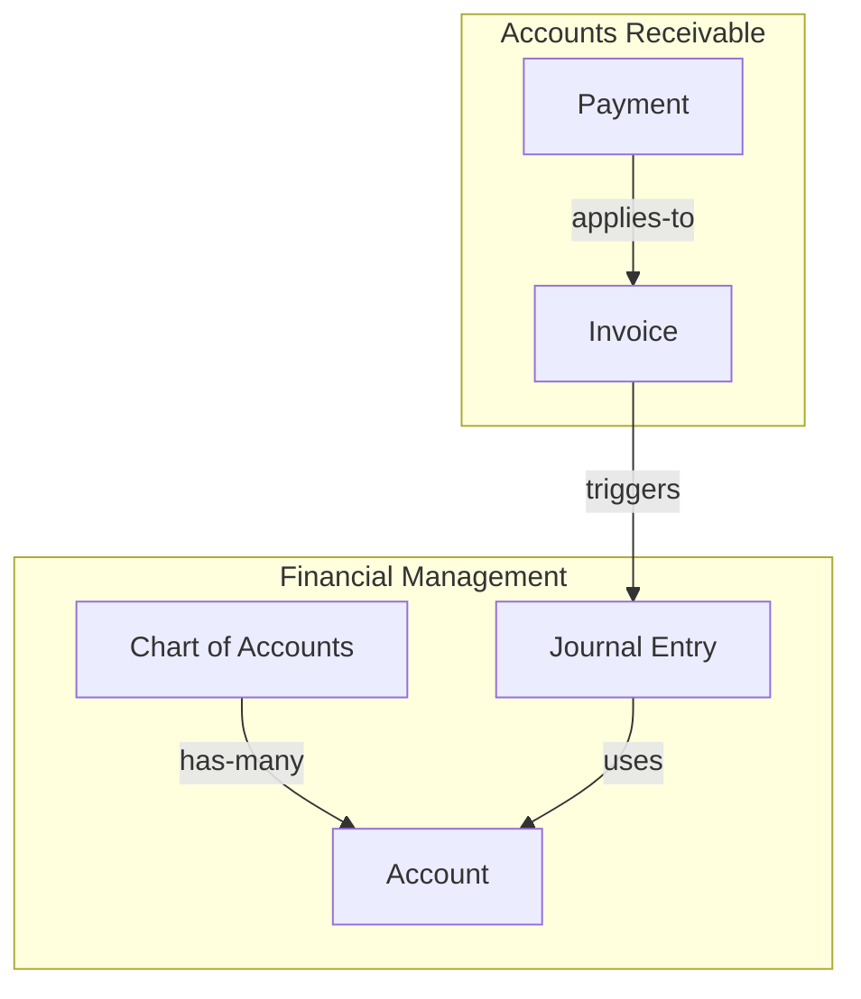

# Knowledge Graph Standards

> **Status:** Active  
> **Version:** 1.0.0  
> **Last Updated:** 2026-07-24  
> **Owner:** Knowledge Engineer  
> **Review Cycle:** Quarterly

---

## 1. Purpose

This document defines how the knowledge graph is represented and maintained. The graph captures relationships between all knowledge artifacts: concepts, rules, workflows, and decisions.

---

## 2. Graph Formats

The knowledge graph is maintained in three formats simultaneously:

| Format | Purpose | Audience |
|--------|---------|----------|
| **Mermaid** | Visual diagrams in markdown | Humans |
| **YAML** | Structured data for tools | AI agents, scripts |
| **JSON** | API consumption | Applications |

All three formats must represent the same graph. The YAML file is the source of truth; Mermaid and JSON are generated from it.

---

## 3. Mermaid Format

### 3.1 Diagram Types

| Type | Purpose | File Pattern |
|------|---------|--------------|
| `graph TD` | Domain map (top-down) | `domain-map.mermaid` |
| `graph LR` | Data flow (left-right) | `{workflow}.mermaid` |
| `classDiagram` | Aggregate structure | `aggregates.mermaid` |
| `erDiagram` | Entity relationships | `er-model.mermaid` |
| `stateDiagram-v2` | State machines | `state-*.mermaid` |

### 3.2 Mermaid Conventions



### 3.3 Mermaid Styling Rules

- Use `subgraph` to group concepts by bounded context.
- Label edges with relationship type.
- Use consistent node IDs matching concept IDs.
- Keep diagrams under 50 nodes for readability.
- Split large graphs into multiple diagrams.

---

## 4. YAML Format

### 4.1 Graph File Structure

```yaml
---
graph_id: KG-001
name: Domain Knowledge Graph
version: 1.0.0
last_updated: 2026-07-24
owner: Knowledge Engineer
---

nodes:
  - id: CON-FIN-001
    type: concept
    name: Chart of Accounts
    context: BC-FIN
    
  - id: CON-FIN-002
    type: concept
    name: Account
    context: BC-FIN

  - id: BR-001
    type: rule
    name: Journal Entry Must Balance
    context: BC-FIN

edges:
  - source: CON-FIN-001
    target: CON-FIN-002
    type: has-many
    label: "contains accounts"
    
  - source: BR-001
    target: CON-FIN-003
    type: enforces
    label: "validates journal entries"
```

### 4.2 Node Types

| Type | Description |
|------|-------------|
| `concept` | Domain concept (CON-*) |
| `rule` | Business rule (BR-*) |
| `workflow` | Process (WF-*) |
| `decision` | ADR or decision |
| `context` | Bounded context |
| `external` | External dependency |

### 4.3 Edge Types

| Type | Description |
|------|-------------|
| `has-many` | One-to-many |
| `belongs-to` | Many-to-one |
| `uses` | Dependency |
| `enforces` | Rule applies to concept |
| `triggers` | Event causation |
| `extends` | Inheritance |
| `related` | General association |

---

## 5. JSON Format

### 5.1 JSON Graph Structure

```json
{
  "graph_id": "KG-001",
  "name": "Domain Knowledge Graph",
  "version": "1.0.0",
  "nodes": [
    {
      "id": "CON-FIN-001",
      "type": "concept",
      "name": "Chart of Accounts",
      "context": "BC-FIN"
    }
  ],
  "edges": [
    {
      "source": "CON-FIN-001",
      "target": "CON-FIN-002",
      "type": "has-many",
      "label": "contains accounts"
    }
  ]
}
```

---

## 6. Graph File Organization

```
knowledge/graph/
├── STANDARDS.md                    # This file
├── graph.yaml                      # Source of truth graph data
├── graph.json                      # Generated JSON format
├── diagrams/
│   ├── domain-map.mermaid          # High-level domain overview
│   ├── financial-context.mermaid   # Financial context detail
│   ├── aggregate-boundaries.mermaid
│   ├── data-flow.mermaid
│   └── state-machines/
│       ├── invoice-state.mermaid
│       └── order-state.mermaid
├── INDEX.md                        # Diagram index
└── CHANGELOG.md                    # Graph change history
```

---

## 7. Graph Validation Rules

1. Every node ID must reference an existing artifact.
2. No orphan nodes — every node must have at least one edge.
3. No dangling edges — source and target must exist.
4. No cycles of length < 3 (avoid A→B→A).
5. Every bounded context must have at least one concept.
6. Edge types must be from the approved list (Section 4.3).

---

## 8. Graph Querying

Common queries the graph supports:

| Query | Purpose |
|-------|---------|
| "What concepts belong to BC-FIN?" | Filter by context |
| "What rules apply to CON-AR-001?" | Find enforcing rules |
| "What workflows use CON-FIN-003?" | Find consuming workflows |
| "What is the full dependency chain from BR-001?" | Trace dependencies |
| "What concepts have no rules?" | Find unprotected concepts |

---

## 9. Validation Checklist

- [ ] All three formats (Mermaid, YAML, JSON) are consistent
- [ ] Node IDs reference existing artifacts
- [ ] No orphan nodes
- [ ] No dangling edges
- [ ] Edge types are from approved list
- [ ] Diagrams are under 50 nodes each
- [ ] Graph file is versioned
- [ ] Change history is maintained
