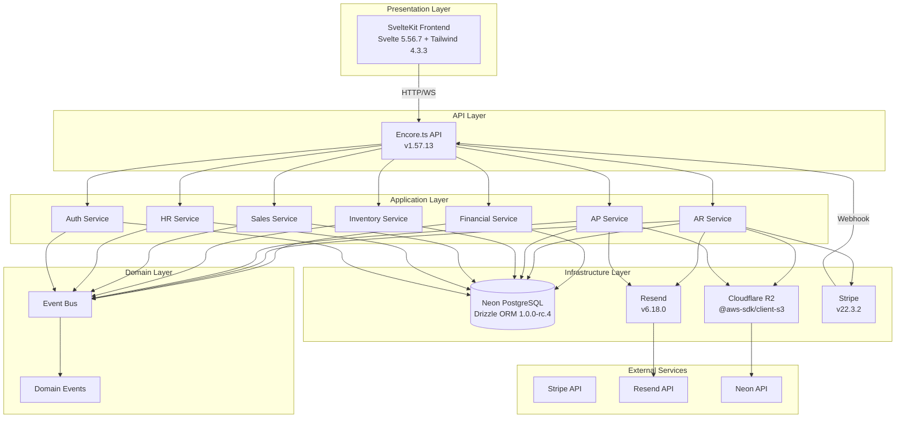
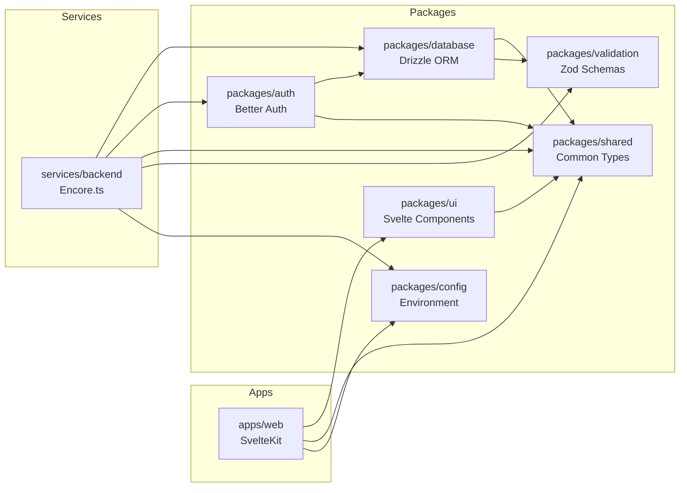
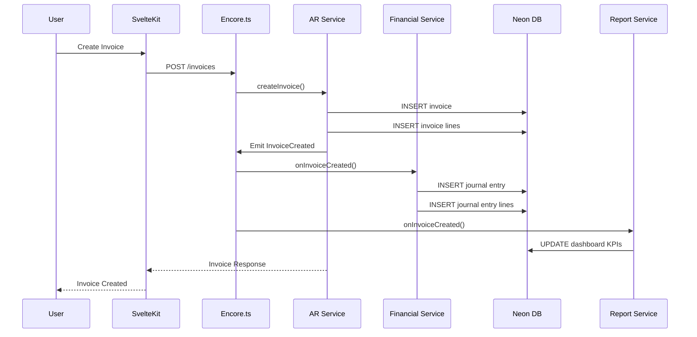
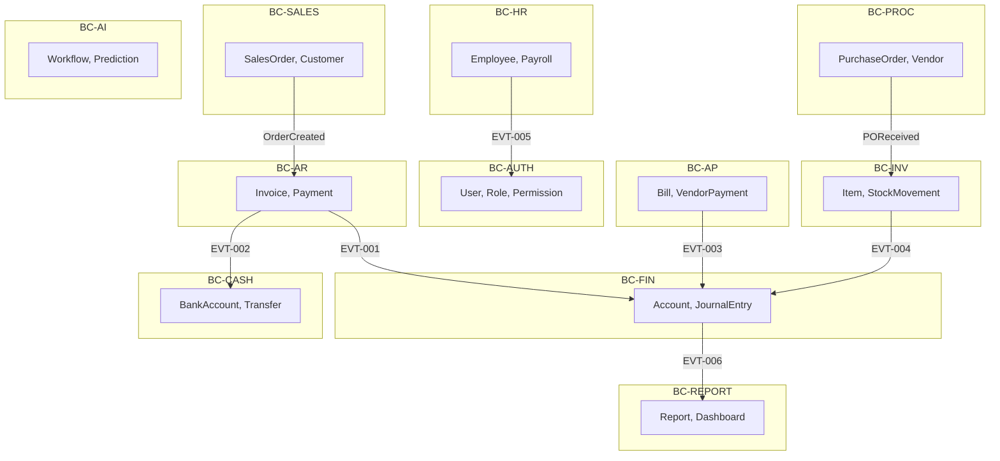
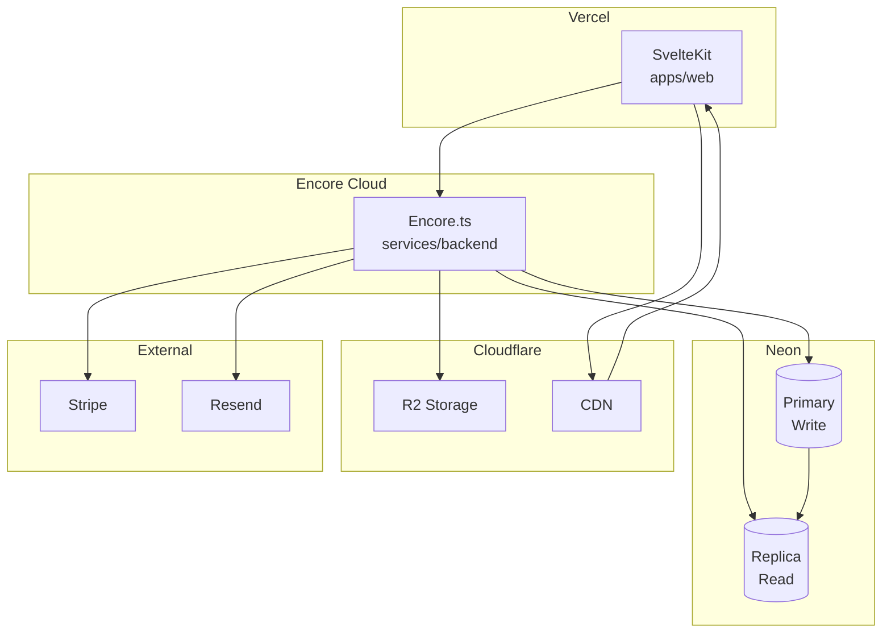

# Lumora ERP System Architecture

## High-Level Architecture

```mermaid
graph TB
    subgraph "Presentation Layer"
        WEB["SvelteKit Frontend<br/>Svelte 5.56.7 + Tailwind 4.3.3"]
    end

    subgraph "API Layer"
        ENCORE["Encore.ts API<br/>v1.57.13"]
    end

    subgraph "Application Layer"
        SVC_FIN["Financial Service"]
        SVC_AR["AR Service"]
        SVC_AP["AP Service"]
        SVC_INV["Inventory Service"]
        SVC_SALES["Sales Service"]
        SVC_HR["HR Service"]
        SVC_AUTH["Auth Service"]
    end

    subgraph "Domain Layer"
        EVT_BUS["Event Bus"]
        DOM_EVT["Domain Events"]
    end

    subgraph "Infrastructure Layer"
        DB[("Neon PostgreSQL<br/>Drizzle ORM 1.0.0-rc.4")]
        R2["Cloudflare R2<br/>@aws-sdk/client-s3"]
        EMAIL["Resend<br/>v6.18.0"]
        PAY["Stripe<br/>v22.3.2"]
    end

    subgraph "External Services"
        STRIPE_EXT["Stripe API"]
        RESEND_EXT["Resend API"]
        NEON_EXT["Neon API"]
    end

    WEB -->|HTTP/WS| ENCORE
    ENCORE --> SVC_FIN
    ENCORE --> SVC_AR
    ENCORE --> SVC_AP
    ENCORE --> SVC_INV
    ENCORE --> SVC_SALES
    ENCORE --> SVC_HR
    ENCORE --> SVC_AUTH

    SVC_FIN --> EVT_BUS
    SVC_AR --> EVT_BUS
    SVC_AP --> EVT_BUS
    SVC_INV --> EVT_BUS
    SVC_SALES --> EVT_BUS
    SVC_HR --> EVT_BUS
    SVC_AUTH --> EVT_BUS

    EVT_BUS --> DOM_EVT

    SVC_FIN --> DB
    SVC_AR --> DB
    SVC_AP --> DB
    SVC_INV --> DB
    SVC_SALES --> DB
    SVC_HR --> DB
    SVC_AUTH --> DB

    SVC_AR --> R2
    SVC_AP --> R2
    SVC_AR --> EMAIL
    SVC_AP --> EMAIL
    SVC_AR --> PAY

    PAY -->|Webhook| ENCORE
    EMAIL --> RESEND_EXT
    R2 --> NEON_EXT
```

## Monorepo Structure

```mermaid
graph LR
    subgraph "Apps"
        WEB["apps/web<br/>SvelteKit"]
    end

    subgraph "Services"
        BACKEND["services/backend<br/>Encore.ts"]
    end

    subgraph "Packages"
        DB["packages/database<br/>Drizzle ORM"]
        AUTH["packages/auth<br/>Better Auth"]
        SHARED["packages/shared<br/>Common Types"]
        VALID["packages/validation<br/>Zod Schemas"]
        CONFIG["packages/config<br/>Environment"]
        UI["packages/ui<br/>Svelte Components"]
    end

    WEB --> UI
    WEB --> SHARED
    WEB --> CONFIG

    BACKEND --> DB
    BACKEND --> AUTH
    BACKEND --> SHARED
    BACKEND --> VALID
    BACKEND --> CONFIG

    DB --> SHARED
    DB --> VALID
    AUTH --> DB
    AUTH --> SHARED
    UI --> SHARED
```

## Data Flow - Invoice Creation

```mermaid
sequenceDiagram
    participant U as User
    participant FE as SvelteKit
    participant API as Encore.ts
    participant AR as AR Service
    participant FIN as Financial Service
    participant DB as Neon DB
    participant RPT as Report Service

    U->>FE: Create Invoice
    FE->>API: POST /invoices
    API->>AR: createInvoice()
    AR->>DB: INSERT invoice
    AR->>DB: INSERT invoice lines
    AR->>API: Emit InvoiceCreated
    API->>FIN: onInvoiceCreated()
    FIN->>DB: INSERT journal entry
    FIN->>DB: INSERT journal entry lines
    API->>RPT: onInvoiceCreated()
    RPT->>DB: UPDATE dashboard KPIs
    AR-->>FE: Invoice Response
    FE-->>U: Invoice Created
```

## Bounded Context Map

```mermaid
graph TB
    subgraph "BC-AUTH"
        AUTH["User, Role, Permission"]
    end

    subgraph "BC-FIN"
        FIN["Account, JournalEntry"]
    end

    subgraph "BC-AR"
        AR["Invoice, Payment"]
    end

    subgraph "BC-AP"
        AP["Bill, VendorPayment"]
    end

    subgraph "BC-CASH"
        CASH["BankAccount, Transfer"]
    end

    subgraph "BC-INV"
        INV["Item, StockMovement"]
    end

    subgraph "BC-PROC"
        PROC["PurchaseOrder, Vendor"]
    end

    subgraph "BC-SALES"
        SALES["SalesOrder, Customer"]
    end

    subgraph "BC-HR"
        HR["Employee, Payroll"]
    end

    subgraph "BC-REPORT"
        RPT["Report, Dashboard"]
    end

    subgraph "BC-AI"
        AI["Workflow, Prediction"]
    end

    AR -->|"EVT-001"| FIN
    AR -->|"EVT-002"| CASH
    AP -->|"EVT-003"| FIN
    INV -->|"EVT-004"| FIN
    HR -->|"EVT-005"| AUTH
    FIN -->|"EVT-006"| RPT
    SALES -->|"OrderCreated"| AR
    PROC -->|"POReceived"| INV
```

## Deployment Architecture

```mermaid
graph TB
    subgraph "Vercel"
        FE["SvelteKit<br/>apps/web"]
    end

    subgraph "Encore Cloud"
        API["Encore.ts<br/>services/backend"]
    end

    subgraph "Neon"
        DB_PRIMARY[(Primary<br/>Write)]
        DB_REPLICA[(Replica<br/>Read)]
    end

    subgraph "Cloudflare"
        R2["R2 Storage"]
        CDN["CDN"]
    end

    subgraph "External"
        STRIPE["Stripe"]
        RESEND["Resend"]
    end

    FE --> CDN
    CDN --> FE
    FE --> API
    API --> DB_PRIMARY
    API --> DB_REPLICA
    API --> R2
    API --> STRIPE
    API --> RESEND
    DB_PRIMARY --> DB_REPLICA
```
