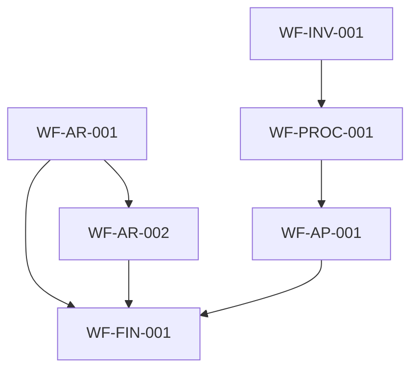

# Workflows Index

> **Last Updated:** 2026-07-24  
> **Total Workflows:** 7  
> **Status:** Active

---

## Workflows by Context

| Context | Count |
|---------|-------|
| BC-FIN | 1 |
| BC-AR | 2 |
| BC-AP | 1 |
| BC-CASH | 0 |
| BC-INV | 1 |
| BC-PROC | 1 |
| BC-SALES | 0 |
| BC-HR | 1 |

---

## Workflows by Type

| Type | Count |
|------|-------|
| Process | 4 |
| Automation | 1 |
| Approval | 1 |
| Integration | 0 |
| Validation | 0 |

---

## Active Workflows

| ID | Name | Context | Type | File |
|----|------|---------|------|------|
| WF-AR-001 | Invoice Creation Workflow | BC-AR | process | [active/WF-AR-001.invoice-creation.md](active/WF-AR-001.invoice-creation.md) |
| WF-AR-002 | Payment Receipt Workflow | BC-AR | process | [active/WF-AR-002.payment-receipt.md](active/WF-AR-002.payment-receipt.md) |
| WF-FIN-001 | Journal Entry Posting Workflow | BC-FIN | process | [active/WF-FIN-001.journal-posting.md](active/WF-FIN-001.journal-posting.md) |
| WF-INV-001 | Stock Reorder Automation | BC-INV | automation | [active/WF-INV-001.stock-reorder.md](active/WF-INV-001.stock-reorder.md) |
| WF-PROC-001 | Purchase Order Workflow | BC-PROC | process | [active/WF-PROC-001.purchase-order.md](active/WF-PROC-001.purchase-order.md) |
| WF-AP-001 | Bill Processing Workflow | BC-AP | process | [active/WF-AP-001.bill-processing.md](active/WF-AP-001.bill-processing.md) |
| WF-HR-001 | Leave Request Approval Workflow | BC-HR | approval | [active/WF-HR-001.leave-request.md](active/WF-HR-001.leave-request.md) |

---

## Workflow Relationships

---

## Diagrams

| Diagram | File |
|---------|------|
| Invoice Creation | [diagrams/invoice-creation.mermaid](diagrams/invoice-creation.mermaid) |
| Payment Receipt | [diagrams/payment-receipt.mermaid](diagrams/payment-receipt.mermaid) |
| Journal Posting | [diagrams/journal-posting.mermaid](diagrams/journal-posting.mermaid) |
| Stock Reorder | [diagrams/stock-reorder.mermaid](diagrams/stock-reorder.mermaid) |
| Purchase Order | [diagrams/purchase-order.mermaid](diagrams/purchase-order.mermaid) |
| Bill Processing | [diagrams/bill-processing.mermaid](diagrams/bill-processing.mermaid) |
| Leave Request | [diagrams/leave-request.mermaid](diagrams/leave-request.mermaid) |
| Order to Cash | [diagrams/order-to-cash.mermaid](diagrams/order-to-cash.mermaid) |

---

*This index is auto-generated. Do not edit manually.*
