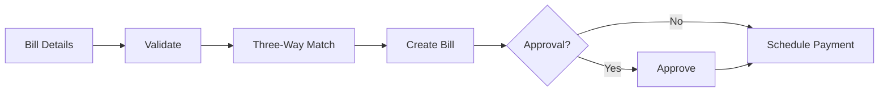

# Bill Processing Workflow

## Overview
Process for receiving, validating, and paying vendor bills with three-way matching.

## Trigger
- **Type:** Manual (command) or Automated (integration)
- **Actor:** AccountsPayable or System
- **Input:** BillDetails (VendorID, InvoiceNumber, Items, Amounts)

## Participants
| Role | Responsibility |
|------|---------------|
| AccountsPayable | Records and validates bill |
| System | Performs three-way matching |
| Approver | Approves for payment |

## Steps

### Step 1: Validate Bill
- **Action:** System validates bill details and vendor existence
- **Input:** BillDetails
- **Output:** ValidatedBill
- **Rules:** INV-AUTH-001 (attribution required)
- **On Failure:** Return error `ERR_INVALID_BILL`

### Step 2: Three-Way Match
- **Action:** System matches bill against purchase order and receiving report
- **Input:** ValidatedBill
- **Output:** MatchResult
- **Rules:** BR-004 (three-way matching required)
- **On Failure:** Return mismatch details for manual review

### Step 3: Create Bill Record
- **Action:** System creates bill record with status PENDING_APPROVAL
- **Input:** MatchResult
- **Output:** BillID
- **Events Emitted:** BillReceived
- **On Failure:** Return error `ERR_BILL_CREATION_FAILED`

### Step 4: Approval Check
- **Action:** System routes bill for approval based on amount and vendor
- **Input:** BillID
- **Output:** ApprovalRequired (boolean)
- **On Failure:** Default to requiring approval

### Step 5: Approve Bill
- **Action:** Approver reviews and approves bill for payment
- **Input:** BillID
- **Output:** BillApproved
- **Events Emitted:** BillApproved
- **On Failure:** Return to draft status

### Step 6: Schedule Payment
- **Action:** System schedules payment based on vendor terms
- **Input:** BillID
- **Output:** PaymentScheduled
- **On Failure:** Return error `ERR_PAYMENT_SCHEDULING_FAILED`

## Exception Handling
| Exception | Handler |
|-----------|---------|
| Vendor not found | Return error, log event |
| Three-way match fails | Return mismatch for review |
| Approval fails | Return to draft status |
| Payment scheduling fails | Return error, queue for retry |

## Data Flow

## Related Workflows
- WF-PROC-001: Purchase Order Workflow
- WF-FIN-001: Journal Entry Posting Workflow

## Change History
| Version | Date | Change | Author |
|---------|------|--------|--------|
| 1.0.0 | 2026-07-24 | Initial definition | Knowledge Engineer |
