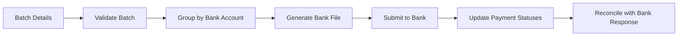

# Batch Payment Processing

## Overview
Process for grouping approved vendor bills into a batch, generating a bank payment file, submitting to the bank, and reconciling the response.

## Trigger
- **Type:** Manual (command)
- **Actor:** Accounts Payable Clerk
- **Input:** BatchPaymentDetails (BillIDs, BankAccountID, PaymentDate)

## Participants
| Role | Responsibility |
|------|---------------|
| AccountsPayable | Initiates batch payment |
| System | Validates, generates file, updates statuses |
| BankIntegration | Receives and processes bank file |
| Approver | Approves batch before submission |

## Steps

### Step 1: Validate Batch Completeness
- **Action:** System validates all bills exist, are in APPROVED status, and have not been previously paid
- **Input:** BatchPaymentDetails
- **Output:** ValidatedBatch
- **Rules:** BR-004 (three-way matching completed for PO-based bills)
- **On Failure:** Return error `ERR_INVALID_BATCH` with details of invalid bills

### Step 2: Group Payments by Bank Account
- **Action:** System groups the validated bills by their designated bank account for payment
- **Input:** ValidatedBatch
- **Output:** PaymentGroups
- **On Failure:** Return error `ERR_GROUPING_FAILED`

### Step 3: Generate Bank File
- **Action:** System generates a payment file in the bank's required format for each payment group
- **Input:** PaymentGroups
- **Output:** BankFile
- **Rules:** INV-FIN-004 (decimal precision for amounts)
- **On Failure:** Return error `ERR_BANK_FILE_GENERATION_FAILED`

### Step 4: Submit to Bank
- **Action:** System submits the bank file to the bank integration for processing
- **Input:** BankFile
- **Output:** BankSubmissionResult
- **Events Emitted:** BatchPaymentSubmitted
- **On Failure:** Return error `ERR_BANK_SUBMISSION_FAILED`, retain batch for retry

### Step 5: Update Payment Statuses
- **Action:** System updates the status of each bill in the batch to PAID and records the payment reference
- **Input:** BankSubmissionResult, ValidatedBatch
- **Output:** UpdatedBills
- **Rules:** INV-FIN-003 (every transaction must have audit trail)
- **Events Emitted:** BillPaid
- **On Failure:** Log error, flag bills for manual status update

### Step 6: Reconcile with Bank Response
- **Action:** System matches bank response against the submitted batch, identifying successes, failures, and partial payments
- **Input:** BankResponse, UpdatedBills
- **Output:** ReconciliationResult
- **Rules:** BR-008 (bank reconciliation requires matching with tolerance)
- **On Failure:** Flag discrepancies for manual review

## Exception Handling
| Exception | Handler |
|-----------|---------|
| Bill already paid | Exclude from batch, log warning |
| Bill not in approved status | Exclude from batch, return error |
| Bank file generation fails | Return error, retain batch |
| Bank submission fails | Retry up to 3 times, then alert |
| Reconciliation discrepancy | Flag for manual review |
| Partial payment received | Process partial, flag remainder |

## Data Flow

## Related Workflows
- WF-AP-001: Bill Processing Workflow
- WF-FIN-001: Journal Entry Posting Workflow
- WF-CASH-001: Bank Reconciliation Workflow

## Change History
| Version | Date | Change | Author |
|---------|------|--------|--------|
| 1.0.0 | 2026-07-25 | Initial definition | Knowledge Engineer |
