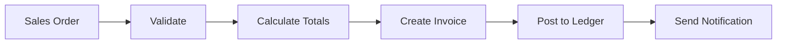

# Invoice Creation Workflow

## Overview
Process for creating a customer invoice from a sales order in the Accounts Receivable context.

## Trigger
- **Type:** Manual (command)
- **Actor:** Accounts Receivable Clerk
- **Input:** SalesOrderID

## Participants
| Role | Responsibility |
|------|---------------|
| AccountsReceivable | Initiates invoice creation |
| System | Validates, calculates, and posts |
| Approver | Approves if over threshold |

## Steps

### Step 1: Validate Sales Order
- **Action:** System validates sales order is complete and has not been previously invoiced
- **Input:** SalesOrderID
- **Output:** Validated SalesOrder
- **Rules:** INV-AR-001 (sales order must exist and be in confirmed status)
- **On Failure:** Return error `ERR_INVALID_SALES_ORDER` to user

### Step 2: Calculate Totals
- **Action:** System calculates line totals, tax, and grand total using decimal arithmetic
- **Input:** Validated SalesOrder
- **Output:** InvoiceTotals
- **Rules:** INV-FIN-004 (decimal precision), BR-002 (debit/credit rules)
- **On Failure:** Return calculation error to user

### Step 3: Create Invoice
- **Action:** System creates invoice record with status DRAFT
- **Input:** InvoiceTotals
- **Output:** InvoiceID
- **Events Emitted:** InvoiceCreated
- **On Failure:** Return creation error to user

### Step 4: Post to Ledger
- **Action:** System creates journal entries for the invoice
- **Input:** InvoiceID
- **Output:** JournalEntryID
- **Rules:** BR-044 (double-entry equality), INV-FIN-001 (balanced entries)
- **On Failure:** Rollback invoice, return error `ERR_LEDGER_POSTING_FAILED`

### Step 5: Send Notification
- **Action:** System sends invoice to customer via email
- **Input:** InvoiceID
- **Output:** EmailSent
- **On Failure:** Log warning, invoice remains in Posted status

## Exception Handling
| Exception | Handler |
|-----------|---------|
| Sales order not found | Return error, log event |
| Validation fails | Return error to user |
| Ledger posting fails | Rollback invoice, return error |
| Email send fails | Log warning, mark as NotSent |

## Data Flow

## Related Workflows
- WF-AR-002: Payment Receipt Workflow
- WF-FIN-001: Journal Entry Posting Workflow

## Change History
| Version | Date | Change | Author |
|---------|------|--------|--------|
| 1.0.0 | 2026-07-24 | Initial definition | Knowledge Engineer |
