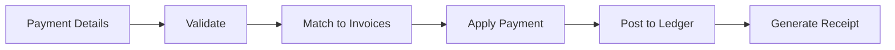

# Payment Receipt Workflow

## Overview
Process for receiving and applying customer payments against outstanding invoices.

## Trigger
- **Type:** Manual (command)
- **Actor:** Accounts Receivable Clerk
- **Input:** PaymentDetails (CustomerID, Amount, BankAccountID, InvoiceIDs)

## Participants
| Role | Responsibility |
|------|---------------|
| AccountsReceivable | Records payment |
| System | Validates and applies payment |
| System | Posts to ledger |

## Steps

### Step 1: Validate Payment
- **Action:** System validates payment details and customer existence
- **Input:** PaymentDetails
- **Output:** ValidatedPayment
- **Rules:** INV-AUTH-001 (attribution required)
- **On Failure:** Return error `ERR_INVALID_PAYMENT`

### Step 2: Match to Invoices
- **Action:** System matches payment to outstanding invoices based on allocation rules
- **Input:** ValidatedPayment
- **Output:** PaymentAllocation
- **Rules:** BR-003 (payment terms per customer)
- **On Failure:** Return error `ERR_NO_OUTSTANDING_INVOICES`

### Step 3: Apply Payment
- **Action:** System creates payment record and updates invoice balances
- **Input:** PaymentAllocation
- **Output:** PaymentID
- **Events Emitted:** PaymentReceived
- **On Failure:** Return error `ERR_PAYMENT_APPLICATION_FAILED`

### Step 4: Post to Ledger
- **Action:** System creates journal entries for the payment
- **Input:** PaymentID
- **Output:** JournalEntryID
- **Rules:** BR-044 (double-entry equality), INV-FIN-001 (balanced entries)
- **On Failure:** Rollback payment, return error `ERR_LEDGER_POSTING_FAILED`

### Step 5: Generate Receipt
- **Action:** System generates payment receipt for customer
- **Input:** PaymentID
- **Output:** ReceiptGenerated
- **On Failure:** Log warning, payment remains applied

## Exception Handling
| Exception | Handler |
|-----------|---------|
| Customer not found | Return error, log event |
| Payment amount exceeds invoice | Return error, suggest overpayment handling |
| Ledger posting fails | Rollback payment, return error |
| Receipt generation fails | Log warning, payment remains applied |

## Data Flow

## Related Workflows
- WF-AR-001: Invoice Creation Workflow
- WF-FIN-001: Journal Entry Posting Workflow

## Change History
| Version | Date | Change | Author |
|---------|------|--------|--------|
| 1.0.0 | 2026-07-24 | Initial definition | Knowledge Engineer |
