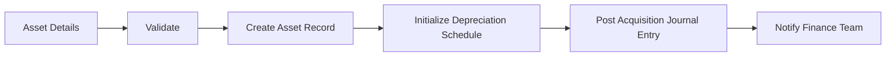

# Asset Acquisition Workflow

## Overview
Process for acquiring a new fixed asset, initializing its depreciation schedule, and posting the acquisition journal entry.

## Trigger
- **Type:** Manual (command)
- **Actor:** Fixed Asset Manager
- **Input:** AssetDetails (Name, Category, AcquisitionCost, SalvageValue, UsefulLife, DepreciationMethod, AcquisitionDate)

## Participants
| Role | Responsibility |
|------|---------------|
| FixedAssetManagement | Initiates asset acquisition |
| System | Validates, creates records, posts entries |
| FinanceTeam | Receives notification of new asset |

## Steps

### Step 1: Validate Asset Details
- **Action:** System validates asset details including category, cost, salvage value, useful life, and depreciation method
- **Input:** AssetDetails
- **Output:** ValidatedAssetDetails
- **Rules:** BR-010 (Land is not depreciable), BR-013 (depreciation method cannot change after placed in service)
- **On Failure:** Return error `ERR_INVALID_ASSET_DETAILS`

### Step 2: Create Asset Record
- **Action:** System creates asset record with status ACQUIRED and assigns a unique asset ID
- **Input:** ValidatedAssetDetails
- **Output:** AssetID
- **Rules:** INV-ASSET-001 (depreciation method, useful life, and salvage value required at acquisition)
- **On Failure:** Return error `ERR_ASSET_CREATION_FAILED`

### Step 3: Initialize Depreciation Schedule
- **Action:** System calculates and creates depreciation schedule entries based on the selected method and useful life
- **Input:** AssetID, ValidatedAssetDetails
- **Output:** DepreciationSchedule
- **Rules:** BR-009 (depreciation methods applied consistently), INV-ASSET-003 (accumulated depreciation cannot exceed depreciable cost)
- **On Failure:** Rollback asset record, return error `ERR_DEPRECIATION_SCHEDULE_FAILED`

### Step 4: Post Acquisition Journal Entry
- **Action:** System creates journal entry debiting the fixed asset account and crediting the payment/liability account
- **Input:** AssetID, AcquisitionCost
- **Output:** JournalEntryID
- **Rules:** INV-FIN-001 (balanced entries), INV-FIN-004 (decimal precision)
- **Events Emitted:** AssetAcquired
- **On Failure:** Rollback asset and schedule, return error `ERR_ACQUISITION_POSTING_FAILED`

### Step 5: Notify Finance Team
- **Action:** System sends notification to the finance team with asset details and journal entry reference
- **Input:** AssetID, JournalEntryID
- **Output:** NotificationSent
- **On Failure:** Log warning, asset remains in Acquired status

## Exception Handling
| Exception | Handler |
|-----------|---------|
| Invalid asset category | Return error, log event |
| Land selected as depreciable asset | Reject with BR-010 violation |
| Journal posting fails | Rollback asset and schedule |
| Notification fails | Log warning, continue |

## Data Flow

## Related Workflows
- WF-ASSET-002: Period Depreciation Run
- WF-ASSET-003: Asset Disposal Workflow
- WF-FIN-001: Journal Entry Posting Workflow

## Change History
| Version | Date | Change | Author |
|---------|------|--------|--------|
| 1.0.0 | 2026-07-25 | Initial definition | Knowledge Engineer |
