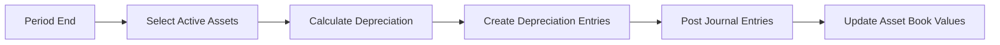

# Period Depreciation Run

## Overview
Automated workflow that runs at the end of each accounting period to calculate and post depreciation for all active fixed assets.

## Trigger
- **Type:** Scheduled (automated)
- **Schedule:** End of each month
- **Actor:** System
- **Input:** PeriodID, PeriodEndDate

## Participants
| Role | Responsibility |
|------|---------------|
| System | Executes depreciation calculation and posting |
| FixedAssetManagement | Reviews depreciation results |
| FinanceTeam | Receives depreciation summary |

## Steps

### Step 1: Select Active Assets
- **Action:** System queries all assets with status ACTIVE that have remaining depreciable life
- **Input:** PeriodEndDate
- **Output:** ActiveAssetsList
- **Rules:** INV-ASSET-002 (depreciation entries must reference an open accounting period)
- **On Failure:** Return error `ERR_ASSET_QUERY_FAILED`

### Step 2: Calculate Depreciation Per Asset
- **Action:** System calculates depreciation amount for each asset based on its method, useful life, and acquisition date
- **Input:** ActiveAssetsList
- **Output:** DepreciationCalculations
- **Rules:** BR-009 (consistent depreciation method), INV-ASSET-003 (accumulated depreciation cannot exceed depreciable cost)
- **On Failure:** Log asset-level error, continue with remaining assets

### Step 3: Create Depreciation Entries
- **Action:** System creates depreciation entry records for each asset
- **Input:** DepreciationCalculations
- **Output:** DepreciationEntries
- **Rules:** INV-ASSET-002 (must reference open period)
- **On Failure:** Skip failed asset, log error, continue batch

### Step 4: Post Journal Entries
- **Action:** System creates journal entries debiting depreciation expense and crediting accumulated depreciation
- **Input:** DepreciationEntries
- **Output:** JournalEntryIDs
- **Rules:** INV-FIN-001 (balanced entries), INV-FIN-004 (decimal precision), BR-011 (depreciation must be posted before period close)
- **Events Emitted:** DepreciationPosted
- **On Failure:** Rollback depreciation entries, return error `ERR_DEPRECIATION_POSTING_FAILED`

### Step 5: Update Asset Book Values
- **Action:** System updates accumulated depreciation and net book value for each asset
- **Input:** JournalEntryIDs, DepreciationEntries
- **Output:** UpdatedAssets
- **Rules:** INV-ASSET-003 (accumulated depreciation cannot exceed depreciable cost)
- **On Failure:** Log inconsistency, flag asset for manual review

## Exception Handling
| Exception | Handler |
|-----------|---------|
| No active assets found | Log informational, complete workflow |
| Asset calculation fails | Skip asset, log error, continue |
| Journal posting fails | Rollback batch, alert finance team |
| Book value inconsistency | Flag asset for manual review |
| Period is closed | Reject run, return error |

## Data Flow

## Related Workflows
- WF-ASSET-001: Asset Acquisition Workflow
- WF-ASSET-003: Asset Disposal Workflow
- WF-FIN-001: Journal Entry Posting Workflow

## Change History
| Version | Date | Change | Author |
|---------|------|--------|--------|
| 1.0.0 | 2026-07-25 | Initial definition | Knowledge Engineer |
