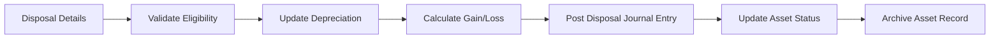

# Asset Disposal Workflow

## Overview
Process for disposing of a fixed asset, including final depreciation update, gain/loss calculation, and status archival.

## Trigger
- **Type:** Manual (command)
- **Actor:** Fixed Asset Manager
- **Input:** DisposalDetails (AssetID, DisposalDate, Proceeds, DisposalMethod)

## Participants
| Role | Responsibility |
|------|---------------|
| FixedAssetManagement | Initiates asset disposal |
| System | Validates, calculates, posts, archives |
| FinanceTeam | Receives disposal summary |

## Steps

### Step 1: Validate Disposal Eligibility
- **Action:** System validates asset exists, is in ACTIVE status, and disposal date is valid
- **Input:** DisposalDetails
- **Output:** ValidatedDisposal
- **Rules:** INV-ASSET-004 (depreciation must be updated to disposal date before removal)
- **On Failure:** Return error `ERR_INVALID_DISPOSAL`

### Step 2: Update Depreciation to Disposal Date
- **Action:** System calculates and posts depreciation from last depreciation date to disposal date
- **Input:** ValidatedDisposal
- **Output:** FinalDepreciationEntry
- **Rules:** BR-011 (depreciation must be posted before period close), INV-ASSET-002 (must reference open period)
- **On Failure:** Return error `ERR_FINAL_DEPRECIATION_FAILED`

### Step 3: Calculate Gain/Loss
- **Action:** System calculates gain or loss on disposal by comparing proceeds to net book value
- **Input:** FinalDepreciationEntry, Proceeds
- **Output:** GainLossAmount
- **Rules:** INV-FIN-004 (decimal precision)
- **On Failure:** Return calculation error

### Step 4: Post Disposal Journal Entry
- **Action:** System creates journal entry removing asset cost, removing accumulated depreciation, recording proceeds, and recognizing gain/loss
- **Input:** GainLossAmount, AssetCost, AccumulatedDepreciation, Proceeds
- **Output:** JournalEntryID
- **Rules:** INV-FIN-001 (balanced entries), INV-FIN-004 (decimal precision)
- **Events Emitted:** AssetDisposed
- **On Failure:** Rollback final depreciation, return error `ERR_DISPOSAL_POSTING_FAILED`

### Step 5: Update Asset Status
- **Action:** System updates asset status to DISPOSED and records disposal date and method
- **Input:** AssetID, DisposalDetails
- **Output:** AssetStatusUpdated
- **On Failure:** Log warning, asset remains in ACTIVE status

### Step 6: Archive Asset Record
- **Action:** System moves asset record to archived state, preserving full history for audit
- **Input:** AssetID
- **Output:** AssetArchived
- **On Failure:** Log warning, asset remains in DISPOSED status

## Exception Handling
| Exception | Handler |
|-----------|---------|
| Asset not found | Return error, log event |
| Asset already disposed | Return error, log event |
| Final depreciation fails | Abort disposal, return error |
| Journal posting fails | Rollback final depreciation |
| Archival fails | Log warning, keep in disposed status |

## Data Flow

## Related Workflows
- WF-ASSET-001: Asset Acquisition Workflow
- WF-ASSET-002: Period Depreciation Run
- WF-FIN-001: Journal Entry Posting Workflow

## Change History
| Version | Date | Change | Author |
|---------|------|--------|--------|
| 1.0.0 | 2026-07-25 | Initial definition | Knowledge Engineer |
