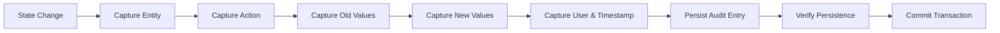

# Audit Log Entry Creation

## Overview
Automated workflow that captures and persists an append-only audit log entry whenever any state-changing operation occurs in the system.

## Trigger
- **Type:** Event-driven (automated)
- **Event:** AnyStateChange
- **Actor:** System
- **Input:** EntityChange (EntityType, EntityID, Action, OldValues, NewValues, UserID, Timestamp)

## Participants
| Role | Responsibility |
|------|---------------|
| System | Captures and persists audit entries |
| AuditCompliance | Reviews and monitors audit log |

## Steps

### Step 1: Capture Entity Type and ID
- **Action:** System extracts the entity type and entity ID from the state change event
- **Input:** EntityChange
- **Output:** EntityType, EntityID
- **Rules:** INV-AUDIT-002 (must reference entity type and entity ID)
- **On Failure:** Log error, skip audit entry

### Step 2: Capture Action Type
- **Action:** System determines the action type (CREATE, UPDATE, DELETE) from the event
- **Input:** EntityChange
- **Output:** ActionType
- **On Failure:** Default to UNKNOWN action type

### Step 3: Capture Old Values (for Updates)
- **Action:** System captures the previous state of the entity for UPDATE operations; null for CREATE/DELETE
- **Input:** EntityChange
- **Output:** OldValues
- **Rules:** BR-023 (must include old and new values for updates), INV-AUDIT-003 (old and new values required)
- **On Failure:** Log warning, capture null for old values

### Step 4: Capture New Values
- **Action:** System captures the new state of the entity for CREATE and UPDATE operations; null for DELETE
- **Input:** EntityChange
- **Output:** NewValues
- **Rules:** BR-023 (must include old and new values for updates)
- **On Failure:** Log warning, capture null for new values

### Step 5: Capture User and Timestamp
- **Action:** System records the user ID (or system process ID) and timestamp of the change
- **Input:** EntityChange
- **Output:** UserID, Timestamp
- **Rules:** INV-AUTH-001 (every action must be attributable)
- **On Failure:** Log error, use system process ID

### Step 6: Persist Audit Entry
- **Action:** System writes the audit log entry to the append-only audit log table
- **Input:** EntityType, EntityID, ActionType, OldValues, NewValues, UserID, Timestamp
- **Output:** AuditLogEntryID
- **Rules:** BR-021 (all state-changing operations must create audit log entry), BR-022 (append-only, no updates or deletes)
- **On Failure:** Return error `ERR_AUDIT_PERSIST_FAILED`, transaction must not commit

### Step 7: Verify Persistence Before Transaction Commit
- **Action:** System verifies the audit entry was successfully persisted before allowing the originating transaction to commit
- **Input:** AuditLogEntryID
- **Output:** PersistenceVerified
- **Rules:** BR-022 (audit entries immutable)
- **On Failure:** Abort parent transaction, return error `ERR_AUDIT_VERIFICATION_FAILED`

## Exception Handling
| Exception | Handler |
|-----------|---------|
| Entity type missing | Log error, skip audit entry |
| Old values capture fails | Log warning, use null |
| Persistence fails | Abort parent transaction |
| Verification fails | Abort parent transaction |

## Data Flow

## Related Workflows
- WF-FIN-001: Journal Entry Posting Workflow
- WF-TAX-002: Tax Rate Update Workflow
- WF-ASSET-001: Asset Acquisition Workflow
- WF-ASSET-003: Asset Disposal Workflow

## Change History
| Version | Date | Change | Author |
|---------|------|--------|--------|
| 1.0.0 | 2026-07-25 | Initial definition | Knowledge Engineer |
