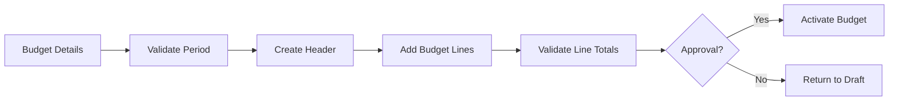

# Budget Creation Workflow

## Overview
Process for creating a new budget with header definition, GL account line allocations, validation, and activation.

## Trigger
- **Type:** Manual (command)
- **Actor:** Budget Manager
- **Input:** BudgetDetails (PeriodStart, PeriodEnd, BudgetLines [{GLAccountID, Amount}])

## Participants
| Role | Responsibility |
|------|---------------|
| BudgetManagement | Defines budget and line allocations |
| System | Validates, creates records, activates |
| Approver | Approves budget before activation |

## Steps

### Step 1: Validate Budget Period
- **Action:** System validates the budget period is valid, does not overlap with existing active budgets, and follows fiscal year configuration
- **Input:** BudgetDetails
- **Output:** ValidatedPeriod
- **Rules:** INV-BUDGET-002 (only one budget active per period per tenant)
- **On Failure:** Return error `ERR_INVALID_BUDGET_PERIOD`

### Step 2: Create Budget Header
- **Action:** System creates the budget header record with status DRAFT
- **Input:** ValidatedPeriod
- **Output:** BudgetHeaderID
- **On Failure:** Return error `ERR_BUDGET_HEADER_CREATION_FAILED`

### Step 3: Add Budget Lines Per GL Account
- **Action:** System creates budget line records for each GL account allocation
- **Input:** BudgetHeaderID, BudgetLines
- **Output:** BudgetLineIDs
- **Rules:** INV-BUDGET-001 (consumption amounts non-negative), BR-018 (consumption tracked per GL account per period)
- **On Failure:** Return error `ERR_BUDGET_LINE_CREATION_FAILED`

### Step 4: Validate Line Totals
- **Action:** System validates that budget line amounts sum to the header total and all GL accounts are valid
- **Input:** BudgetHeaderID, BudgetLineIDs
- **Output:** ValidationResult
- **Rules:** INV-BUDGET-003 (line amounts must sum to header total)
- **On Failure:** Return error `ERR_BUDGET_LINE_TOTAL_MISMATCH`

### Step 5: Submit for Approval
- **Action:** System routes budget to approver for review
- **Input:** BudgetHeaderID
- **Output:** ApprovalRequired
- **On Failure:** Return to draft status

### Step 6: Activate Budget
- **Action:** System sets budget status to ACTIVE upon approval
- **Input:** BudgetHeaderID
- **Output:** BudgetActivated
- **Rules:** INV-BUDGET-002 (only one active budget per period per tenant)
- **Events Emitted:** BudgetActivated
- **On Failure:** Return error `ERR_BUDGET_ACTIVATION_FAILED`

## Exception Handling
| Exception | Handler |
|-----------|---------|
| Period overlaps existing budget | Return error, suggest alternative period |
| Line totals do not sum to header | Return validation error |
| Invalid GL account | Return error, reject line |
| Approval rejected | Return to draft status |
| Activation fails | Return error, keep in submitted status |

## Data Flow

## Related Workflows
- WF-BUDGET-002: Budget Consumption Tracking
- WF-FIN-001: Journal Entry Posting Workflow

## Change History
| Version | Date | Change | Author |
|---------|------|--------|--------|
| 1.0.0 | 2026-07-25 | Initial definition | Knowledge Engineer |
