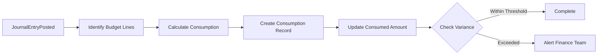

# Budget Consumption Tracking

## Overview
Automated workflow triggered when a journal entry is posted, tracking consumption against active budget lines and alerting when variance thresholds are exceeded.

## Trigger
- **Type:** Event-driven (automated)
- **Event:** JournalEntryPosted
- **Actor:** System
- **Input:** JournalEntryID, GLAccountID, Amount, PeriodID

## Participants
| Role | Responsibility |
|------|---------------|
| System | Tracks consumption and evaluates thresholds |
| BudgetManagement | Reviews budget alerts |
| FinanceTeam | Receives variance notifications |

## Steps

### Step 1: Identify Affected Budget Lines
- **Action:** System queries active budget lines matching the GL account and period from the journal entry
- **Input:** GLAccountID, PeriodID
- **Output:** AffectedBudgetLines
- **Rules:** BR-018 (consumption tracked per GL account per period)
- **On Failure:** Log informational, no budget line found (budget not applicable)

### Step 2: Calculate Consumption Amount
- **Action:** System determines the consumption amount from the journal entry, handling debits as consumption and credits as reversals
- **Input:** JournalEntryID, Amount, AffectedBudgetLines
- **Output:** ConsumptionAmount
- **Rules:** INV-BUDGET-001 (consumption amounts non-negative), BR-020 (consumption reverses when journal entries voided)
- **On Failure:** Log error, skip tracking

### Step 3: Create Consumption Record
- **Action:** System creates a budget consumption record linking the journal entry to the budget line
- **Input:** AffectedBudgetLines, ConsumptionAmount, JournalEntryID
- **Output:** ConsumptionRecordID
- **On Failure:** Log error, skip tracking

### Step 4: Update Consumed Amount on Budget Line
- **Action:** System updates the total consumed amount on the budget line by adding the consumption amount
- **Input:** AffectedBudgetLines, ConsumptionAmount
- **Output:** UpdatedBudgetLine
- **Rules:** BR-019 (variance calculated as consumed minus budgeted)
- **On Failure:** Log error, leave consumed amount unchanged

### Step 5: Check Variance Thresholds
- **Action:** System calculates variance between consumed amount and budgeted amount, comparing against configured thresholds
- **Input:** UpdatedBudgetLine
- **Output:** VarianceResult (within_threshold, warning, exceeded)
- **Rules:** BR-019 (variance calculated as consumed minus budgeted)
- **On Failure:** Log error, flag for manual review

### Step 6: Alert If Exceeded
- **Action:** If variance exceeds threshold, system sends alert to Budget Management and Finance Team
- **Input:** VarianceResult, BudgetLineID
- **Output:** AlertSent
- **Events Emitted:** BudgetExceeded
- **On Failure:** Log warning, alert remains pending

## Exception Handling
| Exception | Handler |
|-----------|---------|
| No active budget line found | Log informational, skip tracking |
| Consumption calculation error | Log error, skip tracking |
| Update consumed amount fails | Log error, leave unchanged |
| Alert delivery fails | Log warning, queue for retry |

## Data Flow

## Related Workflows
- WF-BUDGET-001: Budget Creation Workflow
- WF-FIN-001: Journal Entry Posting Workflow

## Change History
| Version | Date | Change | Author |
|---------|------|--------|--------|
| 1.0.0 | 2026-07-25 | Initial definition | Knowledge Engineer |
