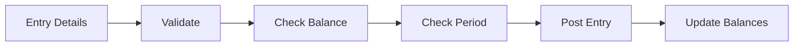

# Journal Entry Posting Workflow

## Overview
Process for creating and posting journal entries to the general ledger with balance validation.

## Trigger
- **Type:** Manual (command) or Automated (event)
- **Actor:** System or FinanceManager
- **Input:** JournalEntryDetails (AccountIDs, Debits, Credits, Description)

## Participants
| Role | Responsibility |
|------|---------------|
| System | Creates and validates entries |
| FinanceManager | Reviews and approves manual entries |

## Steps

### Step 1: Validate Entry
- **Action:** System validates journal entry structure and account existence
- **Input:** JournalEntryDetails
- **Output:** ValidatedEntry
- **Rules:** INV-FIN-005 (chart of accounts hierarchy), BR-002 (debit/credit rules)
- **On Failure:** Return error `ERR_INVALID_JOURNAL_ENTRY`

### Step 2: Check Balance
- **Action:** System verifies total debits equal total credits
- **Input:** ValidatedEntry
- **Output:** BalancedEntry
- **Rules:** BR-044 (double-entry equality), INV-FIN-001 (balanced entries)
- **On Failure:** Return error `ERR_UNBALANCED_ENTRY`

### Step 3: Check Period
- **Action:** System verifies accounting period is open
- **Input:** BalancedEntry
- **Output:** PeriodValidatedEntry
- **Rules:** INV-FIN-002 (closed periods immutable)
- **On Failure:** Return error `ERR_CLOSED_PERIOD`

### Step 4: Post Entry
- **Action:** System creates journal entry record with status POSTED
- **Input:** PeriodValidatedEntry
- **Output:** JournalEntryID
- **Events Emitted:** JournalEntryPosted
- **On Failure:** Return error `ERR_POSTING_FAILED`

### Step 5: Update Balances
- **Action:** System updates account balances in the ledger
- **Input:** JournalEntryID
- **Output:** BalancesUpdated
- **Rules:** BR-051 (journal before ledger)
- **On Failure:** Rollback entry, return error `ERR_BALANCE_UPDATE_FAILED`

## Exception Handling
| Exception | Handler |
|-----------|---------|
| Invalid account | Return error, log event |
| Unbalanced entry | Return error to user |
| Closed period | Return error, suggest period opening |
| Posting fails | Rollback and return error |

## Data Flow

## Related Workflows
- WF-AR-001: Invoice Creation Workflow
- WF-AR-002: Payment Receipt Workflow

## Change History
| Version | Date | Change | Author |
|---------|------|--------|--------|
| 1.0.0 | 2026-07-24 | Initial definition | Knowledge Engineer |
