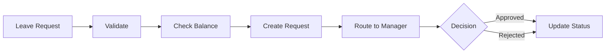

# Leave Request Approval Workflow

## Overview
Process for employees to request leave and managers to approve or reject requests.

## Trigger
- **Type:** Manual (command)
- **Actor:** Employee
- **Input:** LeaveRequestDetails (LeaveType, StartDate, EndDate, Reason)

## Participants
| Role | Responsibility |
|------|---------------|
| Employee | Submits leave request |
| Manager | Reviews and approves/rejects |
| System | Validates and notifies |

## Steps

### Step 1: Validate Request
- **Action:** System validates leave request details and employee eligibility
- **Input:** LeaveRequestDetails
- **Output:** ValidatedRequest
- **Rules:** INV-AUTH-001 (attribution required)
- **On Failure:** Return error `ERR_INVALID_LEAVE_REQUEST`

### Step 2: Check Balance
- **Action:** System checks employee's remaining leave balance
- **Input:** ValidatedRequest
- **Output:** BalanceCheck
- **On Failure:** Return error `ERR_INSUFFICIENT_LEAVE_BALANCE`

### Step 3: Create Request
- **Action:** System creates leave request record with status PENDING
- **Input:** BalanceCheck
- **Output:** LeaveRequestID
- **Events Emitted:** LeaveRequested
- **On Failure:** Return error `ERR_REQUEST_CREATION_FAILED`

### Step 4: Route to Manager
- **Action:** System routes request to employee's direct manager
- **Input:** LeaveRequestID
- **Output:** ManagerNotified
- **Rules:** BR-623 (only manager can approve)
- **On Failure:** Return error `ERR_MANAGER_NOT_FOUND`

### Step 5: Manager Review
- **Action:** Manager reviews request and approves or rejects
- **Input:** LeaveRequestID
- **Output:** Decision
- **Rules:** BR-623 (only manager can approve)
- **On Failure:** Return to pending, escalate to HR

### Step 6: Update Status
- **Action:** System updates request status and notifies employee
- **Input:** Decision
- **Output:** StatusUpdated
- **Events Emitted:** LeaveApproved or LeaveRejected
- **On Failure:** Log warning, status remains pending

## Exception Handling
| Exception | Handler |
|-----------|---------|
| Employee not found | Return error, log event |
| Insufficient balance | Return error, suggest alternatives |
| Manager not found | Escalate to HR |
| Approval fails | Return to pending, escalate |

## Data Flow

## Related Workflows
- WF-HR-002: Payroll Processing (future)

## Change History
| Version | Date | Change | Author |
|---------|------|--------|--------|
| 1.0.0 | 2026-07-24 | Initial definition | Knowledge Engineer |
