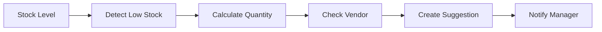

# Stock Reorder Automation

## Overview
Automated workflow triggered when stock levels fall below reorder point, generating purchase suggestions.

## Trigger
- **Type:** Automated (event)
- **Actor:** System
- **Input:** ItemID, CurrentStockLevel

## Participants
| Role | Responsibility |
|------|---------------|
| System | Monitors stock and generates suggestions |
| InventoryManager | Reviews and approves purchase suggestions |

## Steps

### Step 1: Detect Low Stock
- **Action:** System detects stock level below reorder point
- **Input:** StockLevelData
- **Output:** LowStockAlert
- **Rules:** BR-005 (reorder point triggers)
- **On Failure:** Log error, continue monitoring

### Step 2: Calculate Reorder Quantity
- **Action:** System calculates optimal reorder quantity based on lead time and demand
- **Input:** LowStockAlert
- **Output:** ReorderSuggestion
- **On Failure:** Use default reorder quantity

### Step 3: Check Vendor Availability
- **Action:** System validates vendor and catalog item availability
- **Input:** ReorderSuggestion
- **Output:** ValidatedSuggestion
- **On Failure:** Flag for manual review

### Step 4: Create Purchase Suggestion
- **Action:** System creates purchase suggestion record
- **Input:** ValidatedSuggestion
- **Output:** PurchaseSuggestionID
- **On Failure:** Log error, queue for retry

### Step 5: Notify Inventory Manager
- **Action:** System sends notification to inventory manager for review
- **Input:** PurchaseSuggestionID
- **Output:** NotificationSent
- **On Failure:** Log warning, suggestion remains pending

## Exception Handling
| Exception | Handler |
|-----------|---------|
| Vendor not found | Flag for manual vendor selection |
| Catalog item unavailable | Flag for manual item review |
| Calculation fails | Use default reorder quantity |
| Notification fails | Log warning, suggestion remains pending |

## Data Flow

## Related Workflows
- WF-PROC-001: Purchase Order Workflow

## Change History
| Version | Date | Change | Author |
|---------|------|--------|--------|
| 1.0.0 | 2026-07-24 | Initial definition | Knowledge Engineer |
