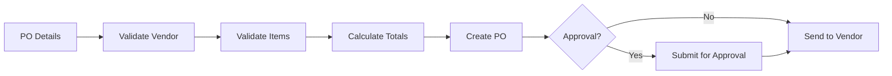

# Purchase Order Workflow

## Overview
Process for creating, approving, and sending purchase orders to vendors.

## Trigger
- **Type:** Manual (command)
- **Actor:** ProcurementManager
- **Input:** PurchaseOrderDetails (VendorID, Items, Quantities)

## Participants
| Role | Responsibility |
|------|---------------|
| ProcurementManager | Creates purchase order |
| System | Validates and processes |
| Approver | Approves if over threshold |

## Steps

### Step 1: Validate Vendor
- **Action:** System validates vendor exists and is active
- **Input:** VendorID
- **Output:** ValidatedVendor
- **On Failure:** Return error `ERR_INVALID_VENDOR`

### Step 2: Validate Items
- **Action:** System validates all items exist in catalog with valid pricing
- **Input:** ItemDetails
- **Output:** ValidatedItems
- **On Failure:** Return error `ERR_INVALID_ITEMS`

### Step 3: Calculate Totals
- **Action:** System calculates line totals and grand total
- **Input:** ValidatedItems
- **Output:** OrderTotals
- **Rules:** INV-FIN-004 (decimal precision)
- **On Failure:** Return calculation error

### Step 4: Create Purchase Order
- **Action:** System creates PO record with status DRAFT
- **Input:** OrderTotals
- **Output:** PurchaseOrderID
- **Events Emitted:** PurchaseOrderCreated
- **On Failure:** Return error `ERR_PO_CREATION_FAILED`

### Step 5: Approval Check
- **Action:** System checks if PO requires approval based on amount threshold
- **Input:** PurchaseOrderID
- **Output:** ApprovalRequired (boolean)
- **On Failure:** Default to requiring approval

### Step 6: Submit for Approval
- **Action:** System routes PO to approver if required
- **Input:** PurchaseOrderID
- **Output:** POStatus
- **On Failure:** Return error `ERR_APPROVAL_ROUTING_FAILED`

### Step 7: Send to Vendor
- **Action:** System sends approved PO to vendor via email
- **Input:** PurchaseOrderID
- **Output:** POSENT
- **On Failure:** Log warning, PO remains in Approved status

## Exception Handling
| Exception | Handler |
|-----------|---------|
| Vendor not found | Return error, log event |
| Invalid items | Return error to user |
| Approval fails | Return to draft status |
| Email send fails | Log warning, PO remains approved |

## Data Flow

## Related Workflows
- WF-INV-001: Stock Reorder Automation
- WF-AP-001: Bill Processing Workflow

## Change History
| Version | Date | Change | Author |
|---------|------|--------|--------|
| 1.0.0 | 2026-07-24 | Initial definition | Knowledge Engineer |
