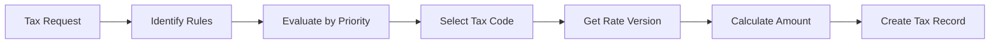

# Tax Calculation Workflow

## Overview
Process for calculating tax on a transaction by evaluating applicable tax rules, selecting the correct tax code and rate, and creating a tax transaction record.

## Trigger
- **Type:** Manual (command) or Automated (invoked by other workflows)
- **Actor:** System or Tax Manager
- **Input:** TaxCalculationRequest (TransactionType, Items, Amounts, Jurisdiction, Date)

## Participants
| Role | Responsibility |
|------|---------------|
| System | Executes tax calculation and record creation |
| TaxManagement | Reviews and overrides tax assignments |

## Steps

### Step 1: Identify Applicable Tax Rules
- **Action:** System identifies all tax rules that apply to the transaction based on type, items, and jurisdiction
- **Input:** TaxCalculationRequest
- **Output:** ApplicableRules
- **Rules:** BR-017 (expired tax rates cannot be applied to new transactions)
- **On Failure:** Return error `ERR_NO_APPLICABLE_TAX_RULES`

### Step 2: Evaluate Rules by Priority
- **Action:** System evaluates applicable rules in priority order to determine the correct tax code
- **Input:** ApplicableRules
- **Output:** SelectedTaxCode
- **Rules:** BR-016 (tax auto-assignment rules evaluated by priority order)
- **On Failure:** Return error `ERR_TAX_RULE_EVALUATION_FAILED`

### Step 3: Select Tax Code
- **Action:** System selects the tax code determined by rule evaluation
- **Input:** SelectedTaxCode
- **Output:** TaxCodeRecord
- **Rules:** INV-TAX-003 (tax codes must link to a GL account)
- **On Failure:** Return error `ERR_INVALID_TAX_CODE`

### Step 4: Get Current Tax Rate Version
- **Action:** System retrieves the current effective tax rate version for the selected tax code as of the transaction date
- **Input:** TaxCodeRecord, TransactionDate
- **Output:** TaxRateVersion
- **Rules:** INV-TAX-001 (tax rates must have effective date), BR-017 (expired rates cannot be applied)
- **On Failure:** Return error `ERR_NO_ACTIVE_TAX_RATE`

### Step 5: Calculate Tax Amount
- **Action:** System calculates tax amount using decimal arithmetic on the transaction base amount and the tax rate
- **Input:** TaxRateVersion, TransactionAmounts
- **Output:** TaxAmount
- **Rules:** INV-FIN-004 (decimal precision), INV-TAX-002 (tax amount snapshotted at time of calculation)
- **On Failure:** Return calculation error

### Step 6: Create Tax Transaction Record
- **Action:** System creates a tax transaction record capturing the tax code, rate version, calculated amount, and transaction reference
- **Input:** TaxCodeRecord, TaxRateVersion, TaxAmount, TransactionReference
- **Output:** TaxTransactionID
- **Rules:** BR-015 (tax amount snapshotted at transaction time), INV-TAX-002 (snapshot rate, not current rate)
- **Events Emitted:** TaxCalculated
- **On Failure:** Return error `ERR_TAX_RECORD_FAILED`

## Exception Handling
| Exception | Handler |
|-----------|---------|
| No applicable tax rules | Return error, log event |
| Expired tax rate | Return error, flag for rate update |
| Tax code missing GL account | Return error, log event |
| Calculation precision error | Return error, halt transaction |

## Data Flow

## Related Workflows
- WF-TAX-002: Tax Rate Update Workflow
- WF-FIN-001: Journal Entry Posting Workflow
- WF-AR-001: Invoice Creation Workflow
- WF-AP-001: Bill Processing Workflow

## Change History
| Version | Date | Change | Author |
|---------|------|--------|--------|
| 1.0.0 | 2026-07-25 | Initial definition | Knowledge Engineer |
