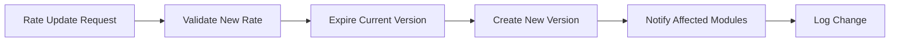

# Tax Rate Update Workflow

## Overview
Process for updating a tax rate by expiring the current version and creating a new effective version, with notification to affected modules.

## Trigger
- **Type:** Manual (command)
- **Actor:** Tax Manager
- **Input:** TaxRateUpdateDetails (TaxCodeID, NewRate, EffectiveDate, ExpiryDate)

## Participants
| Role | Responsibility |
|------|---------------|
| TaxManagement | Initiates rate update |
| System | Validates, expires, creates new version |
| FinanceTeam | Receives notification of rate change |

## Steps

### Step 1: Validate New Rate
- **Action:** System validates the new tax rate is non-negative, the effective date is valid, and the tax code exists
- **Input:** TaxRateUpdateDetails
- **Output:** ValidatedRateDetails
- **Rules:** INV-TAX-001 (effective date required)
- **On Failure:** Return error `ERR_INVALID_TAX_RATE`

### Step 2: Expire Current Rate Version
- **Action:** System sets the expiry date on the current active tax rate version to one day before the new effective date
- **Input:** ValidatedRateDetails
- **Output:** ExpiredRateVersion
- **Rules:** BR-014 (tax rates versioned with effective dates)
- **On Failure:** Return error `ERR_RATE_EXPIRY_FAILED`

### Step 3: Create New Rate Version
- **Action:** System creates a new tax rate version record with the new rate and effective date
- **Input:** ValidatedRateDetails
- **Output:** NewRateVersionID
- **Rules:** BR-014 (versioned with effective dates), INV-TAX-001 (effective date required)
- **Events Emitted:** TaxRateCreated
- **On Failure:** Rollback expiry, return error `ERR_RATE_CREATION_FAILED`

### Step 4: Notify Affected Modules
- **Action:** System sends notifications to AR, AP, and other modules that consume tax rates, informing them of the upcoming rate change
- **Input:** NewRateVersionID, EffectiveDate
- **Output:** NotificationsSent
- **On Failure:** Log warning, rate change remains in effect

### Step 5: Log Change
- **Action:** System creates an audit log entry recording the tax rate change with old and new values
- **Input:** ExpiredRateVersion, NewRateVersionID
- **Output:** AuditLogEntryID
- **Rules:** BR-021 (all state-changing operations must create audit log entry)
- **On Failure:** Log warning, rate change remains in effect

## Exception Handling
| Exception | Handler |
|-----------|---------|
| Tax code not found | Return error, log event |
| New rate is negative | Reject, return validation error |
| Effective date in the past | Reject, return validation error |
| Rate creation fails | Rollback expiry, return error |
| Notification fails | Log warning, continue |

## Data Flow

## Related Workflows
- WF-TAX-001: Tax Calculation Workflow
- WF-FIN-001: Journal Entry Posting Workflow
- WF-AUDIT-001: Audit Log Entry Creation

## Change History
| Version | Date | Change | Author |
|---------|------|--------|--------|
| 1.0.0 | 2026-07-25 | Initial definition | Knowledge Engineer |
